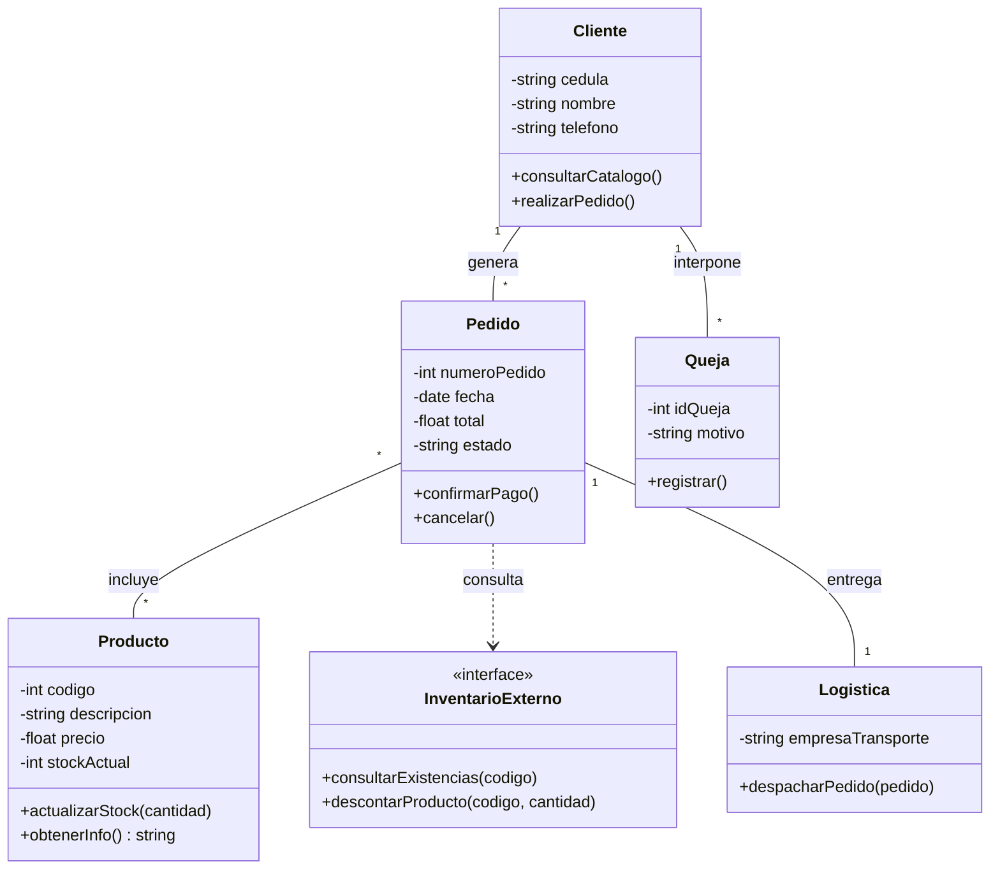

# Diseño de Clases - TeleVentas

```mermaid
classDiagram
    class Producto {
        -int codigo
        -string descripcion
        -float precio
        -int stockActual
        +actualizarStock(cantidad)
        +obtenerInfo() string
    }
    
    class Cliente {
        -string cedula
        -string nombre
        -string telefono
        +consultarCatalogo()
        +realizarPedido()
    }

    class Pedido {
        -int numeroPedido
        -date fecha
        -float total
        -string estado
        +confirmarPago()
        +cancelar()
    }

    class InventarioExterno {
        <<interface>>
        +consultarExistencias(codigo)
        +descontarProducto(codigo, cantidad)
    }

    class Logistica {
        -string empresaTransporte
        +despacharPedido(pedido)
    }

    class Queja {
        -int idQueja
        -string motivo
        +registrar()
    }

    Cliente "1" -- "*" Pedido : genera
    Pedido "*" -- "*" Producto : incluye
    Pedido ..> InventarioExterno : consulta
    Pedido "1" -- "1" Logistica : entrega
    Cliente "1" -- "*" Queja : interpone
```