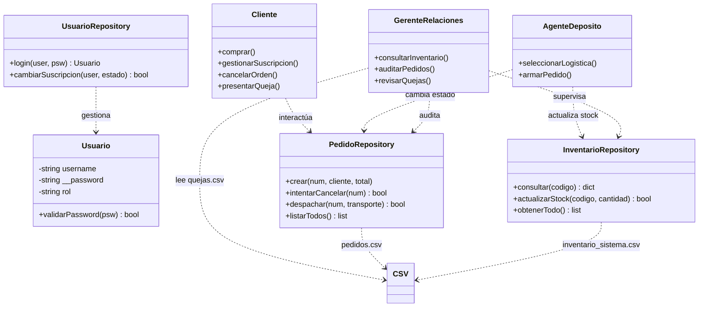

# Manual de Programación: Ejercicio 1 - TeleVentas

## 1. Requerimientos Funcionales

Gestión del Catálogo: Consulta de información técnica (código, descripción, precio, stock) desde un sistema externo.

Suscripción Informativa: Gestión de alta y baja de suscripción para envío de catálogo por email.

Gestión de Órdenes: Ingreso de pedidos con cargo automático a tarjeta y cancelación sujeta a estado logístico.

Gestión de Quejas: Registro por parte del cliente y remisión inmediata para auditoría gerencial.

Operaciones de Depósito: Armado de pedidos, actualización de stock y selección de logística de transporte por parte del Agente.

Supervisión Gerencial (Super Usuario): Acceso total e irrestricto a la visualización de inventarios, historial de pedidos con su logística y buzón de quejas para la toma de decisiones.

## 2. Reglas de Negocio

Restricción de Pago: Únicamente se admite Tarjeta de Crédito (cargo automático a la tarjeta registrada).

Validación de Cancelación: Solo se permiten cancelaciones si el pedido no ha sido marcado como "Enviado".

Seguridad Obligatoria: Todos los usuarios deben autenticarse; el acceso a funciones depende del rol asignado (Cliente, Agente o Gerente).

## 3. Integración y Restricciones Técnicas

Sistema Preexistente: Interacción obligatoria con un archivo inventario_sistema.csv.

Persistencia Integral: Uso de 4 archivos CSV (usuarios.csv, inventario_sistema.csv, pedidos.csv, quejas.csv) para garantizar la trazabilidad.

Encapsulamiento: Las credenciales se manejan como atributos privados en la clase Usuario.

## 4. Modelado Matemático
Cálculo del valor total ($T$):
$$T = \sum_{i=1}^{n} (p_i \times q_i)$$

Actualización de inventario:
$$S_{final} = S_{inicial} - q_{despachado}$$

## 5. Diagrama de Clases (UML)

## 6 Justificación del Diseño según Requerimientos

El diseño arquitectónico se ha estructurado para responder de manera exacta a las necesidades de TeleVentas, basándose en los siguientes pilares:

Interacción con Sistemas Preexistentes: Mediante el Patrón Repository, se garantiza que el sistema web pueda consultar y actualizar el inventario de la empresa sin acoplar la lógica de negocio al formato físico de los datos.

Gestión de Órdenes y Pagos: Se implementó una lógica de control que automatiza el flujo de compra. El sistema procesa el requerimiento ajustándose a la política financiera de la empresa (actualmente la tarjeta de crédito es la única opción de pago disponible).

Integración Logística: El diseño provee soporte directo a los Agentes de Depósito para la toma de decisiones, facilitando la selección de la empresa de transporte y asegurando que el estado del pedido cambie a "Enviado" solo tras validar el inventario.

Rol de Super Usuario (Gerente): Se ha diseñado un perfil de Gerente de Relaciones con privilegios elevados. Este rol actúa como un monitor central del sistema, con capacidad de leer todos los repositorios (Inventario, Pedidos y Quejas). Esta centralización permite una auditoría completa del ciclo de vida de la orden y una respuesta inmediata a las incidencias reportadas por los clientes.

Seguridad y Encapsulamiento: Cumpliendo con la restricción técnica de autenticación, se utiliza Encapsulamiento para proteger la información sensible. El uso de atributos privados (__password) asegura que las credenciales no sean accesibles fuera de los métodos de validación.

Control de Estados: La lógica de cancelación está blindada por una regla de negocio que verifica el estado logístico, impidiendo anulaciones de órdenes ya delegadas a transporte.

## 7. Estándares de Calidad:
Aplicación de principios S.O.L.I.D.
Uso estricto de PEP8 para Python.
Búsqueda de alta cohesión y bajo acoplamiento.

## 8. Entregables Esperados
Análisis y diseño que incluya diagramas de clases UML con atributos y métodos.
Código fuente funcional en un repositorio