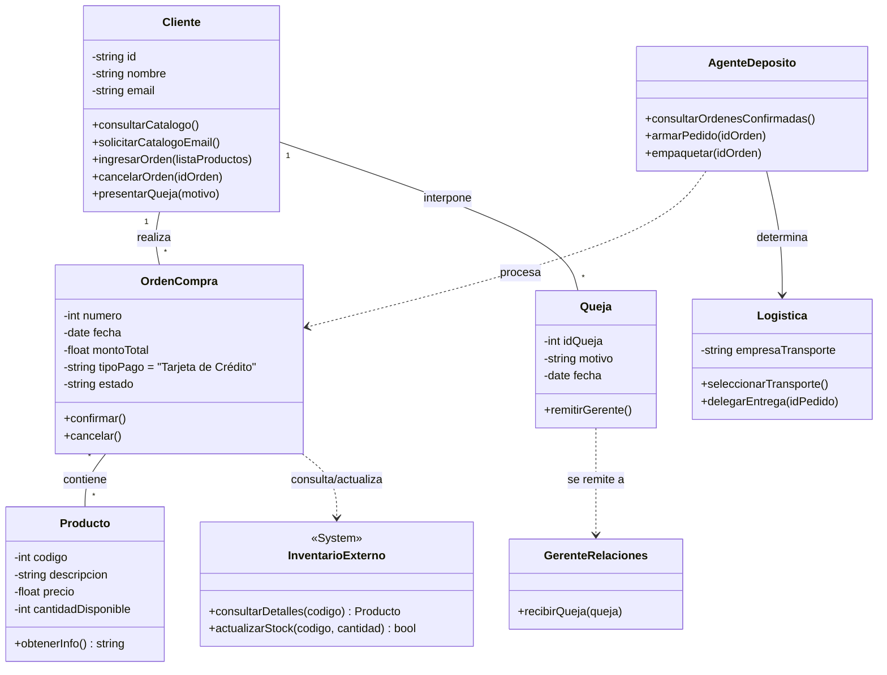

# Manual de Programación: Ejercicio 1 - TeleVentas

## 1.Requerimientos Funcionales 

Gestión del Catálogo: El sistema debe permitir consultar información detallada de productos, incluyendo código, descripción, precio y cantidad disponible.

Suscripción Informativa: Los clientes deben poder solicitar el envío periódico del catálogo a través de su correo electrónico.

Gestión de Órdenes: * Ingreso de órdenes de compra para un conjunto de productos.

Cancelación de órdenes existentes.

Gestión de Quejas: Registro de quejas por parte de los clientes (ej. demoras en entregas).

Operaciones de Depósito (Bodega):

Consulta de órdenes confirmadas para el armado y empaquetado de productos.

Determinación de la logística de entrega para cada pedido armado.

Selección de la empresa de transporte y delegación de la entrega.

## 2. Reglas de Negocio

Restricción de Pago: Actualmente, el sistema solo debe admitir tarjeta de crédito como tipo de pago.

Flujo de Quejas: Las quejas recibidas deben remitirse de forma inmediata al gerente de relaciones de la empresa.

## 3. Integración y Restricciones Técnicas

Sistema Preexistente: El nuevo software debe interactuar obligatoriamente con un sistema de inventario que ya posee la empresa.

Intercambio de Datos:

Consultar descripción y precio al momento de tomar la orden.

Actualizar la disponibilidad (stock) de productos al momento de armar los pedidos.

## 4. Modelado Matemático
El cálculo del valor total de un pedido ($T$) se define como la sumatoria del producto entre el precio ($p$) y la cantidad ($q$) de cada ítem:
$$T = \sum_{i=1}^{n} (p_i \times q_i)$$

La actualización del inventario sigue la lógica de sustracción simple:
$$S_{final} = S_{inicial} - q_{despachado}$$

## 5. Diagrama de Clases (UML)

## 6 Justificación del Diseño según Requerimientos

Clase Producto: Incluye los atributos obligatorios: código, descripción, precio y cantidad disponible.

Interfaz con InventarioExterno: Se modela como una entidad separada con la que el sistema debe interactuar para validar precios y actualizar el stock al armar los pedidos.

Restricción de Pago: La clase OrdenCompra tiene predefinido el atributo tipoPago como "Tarjeta de Crédito", cumpliendo con la limitación actual del sistema.

Flujo de Depósito y Logística: Se incluyen las clases AgenteDeposito y Logistica para cubrir las tareas de armado, empaquetado y selección de la empresa de transporte.

Gestión de Quejas: Se implementa la clase Queja con un método de remisión inmediata al GerenteRelaciones, tal como lo exige el flujo del negocio.

Acciones del Cliente: Se han mapeado todos los métodos solicitados: consulta de catálogo, solicitud por email, ingreso/cancelación de órdenes y presentación de quejas .

## 7. Estándares de Calidad:
Aplicación de principios S.O.L.I.D.
Uso estricto de PEP8 para Python.
Búsqueda de alta cohesión y bajo acoplamiento.

## 8. Entregables Esperados
Análisis y diseño que incluya diagramas de clases UML con atributos y métodos.
Código fuente funcional en un repositorio