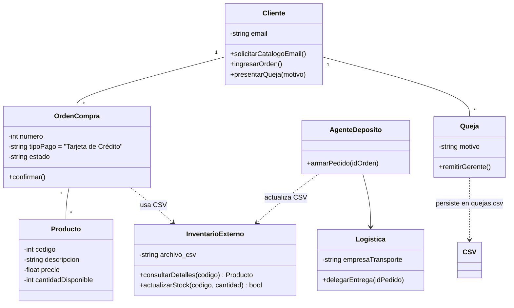

# Manual de Programación: Ejercicio 1 - TeleVentas

## 1.Requerimientos Funcionales 
## 1. Requerimientos Funcionales 
* **Gestión del Catálogo:** Consulta de código, descripción, precio y stock.
* **Suscripción Informativa:** Envío de catálogo por correo electrónico.
* **Gestión de Órdenes:** Ingreso y cancelación de pedidos.
* **Gestión de Quejas:** Registro y remisión inmediata al gerente.
* **Operaciones de Depósito:** Armado, empaquetado y selección de logística de entrega.

## 2. Reglas de Negocio
* **Restricción de Pago:** Únicamente se admite Tarjeta de Crédito.
* **Flujo de Quejas:** Envío automático al Gerente de Relaciones.

## 3. Integración y Restricciones Técnicas
* **Sistema Preexistente:** Interacción obligatoria con el inventario de la empresa.
* **Persistencia:** El intercambio de datos se realiza mediante un archivo `inventario.csv` que actúa como base de datos externa.

## 4. Modelado Matemático
Cálculo del valor total ($T$):
$$T = \sum_{i=1}^{n} (p_i \times q_i)$$

Actualización de inventario:
$$S_{final} = S_{inicial} - q_{despachado}$$

## 5. Diagrama de Clases (UML)

## 6 Justificación del Diseño según Requerimientos

El diseño utiliza una arquitectura desacoplada donde la clase InventarioExterno encapsula toda la lógica de lectura/escritura del archivo CSV. Esto permite que el resto del sistema (como la clase OrdenCompra) trabaje con objetos de tipo Producto sin preocuparse por el formato del archivo externo, cumpliendo con el principio de Responsabilidad Única

Clase Producto: Incluye los atributos obligatorios: código, descripción, precio y cantidad disponible.

Interfaz con InventarioExterno: Se modela como una entidad separada con la que el sistema debe interactuar para validar precios y actualizar el stock al armar los pedidos.

Restricción de Pago: La clase OrdenCompra tiene predefinido el atributo tipoPago como "Tarjeta de Crédito", cumpliendo con la limitación actual del sistema.

Flujo de Depósito y Logística: Se incluyen las clases AgenteDeposito y Logistica para cubrir las tareas de armado, empaquetado y selección de la empresa de transporte.

Gestión de Quejas: Se implementa la clase Queja con un método de remisión inmediata al GerenteRelaciones, tal como lo exige el flujo del negocio.

Acciones del Cliente: Se han mapeado todos los métodos solicitados: consulta de catálogo, solicitud por email, ingreso/cancelación de órdenes y presentación de quejas.

## 7. Estándares de Calidad:
Aplicación de principios S.O.L.I.D.
Uso estricto de PEP8 para Python.
Búsqueda de alta cohesión y bajo acoplamiento.

## 8. Entregables Esperados
Análisis y diseño que incluya diagramas de clases UML con atributos y métodos.
Código fuente funcional en un repositorio