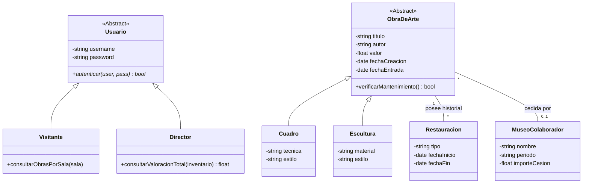

# Manual de Programación: Ejercicio 2 - Gestión de Museo
## 1. Requerimientos Funcionales
Gestión de Inventario de Arte: Registro detallado de obras incluyendo cuadros, esculturas y otros objetos. Atributos base: título, autor, valor económico, fecha de creación y fecha de entrada al museo.

Clasificación Especializada:Cuadros: Registro de técnica (óleo, acuarela, etc.) y estilo.

Esculturas: Registro de material (mármol, bronce, etc.) y estilo.

Trazabilidad de Restauraciones: Registro histórico de intervenciones incluyendo tipo de restauración, fecha de inicio y fecha de finalización.

Gestión de Convenios: Control de obras cedidas por o a otros museos, registrando el nombre del museo colaborador, periodo de cesión e importe económico.

Consultas por Perfil:Visitantes: Consulta de listados de obras organizados por salas.

Director: Consulta de la valoración económica total de toda la colección.

Sistema de Seguridad: Autenticación obligatoria para todos los usuarios antes de acceder a cualquier funcionalidad.

## 2. Reglas de Negocio

Alerta de Mantenimiento Preventivo: El sistema debe generar una alerta automática si han transcurrido 5 años desde la fecha de entrada de la obra al museo o desde su última restauración.

Control de Acceso: No se permiten consultas o registros anónimos; la identidad del usuario determina los privilegios de visualización.

## 3. Integración y Restricciones Técnicas

Jerarquía de Clases: Implementación de herencia para especializar los tipos de obras de arte y los roles de usuario.

Abstracción de Datos: Uso de clases abstractas para definir la estructura base de las obras y los usuarios, impidiendo instancias incompletas.

## 4. Modelado Matemático

Para garantizar la precisión en la administración de los activos del museo y el cumplimiento de los protocolos de conservación, se han definido los siguientes modelos:

### 4.1. Valoración Patrimonial Total
La valoración total de la colección ($V_{total}$) se calcula mediante la sumatoria del valor económico individual ($v$) de cada obra ($i$) registrada en el inventario actual de la institución:

$$V_{total} = \sum_{i=1}^{n} v_i$$

Donde:
* $n$: Número total de obras en el inventario.
* $v_i$: Valor asignado a la i-ésima obra de arte.

### 4.2. Algoritmo de Alerta de Mantenimiento Preventivo

La integridad física de las obras se gestiona mediante una alerta basada en el tiempo transcurrido ($\Delta t$). Se define la diferencia entre la fecha del sistema ($f_{actual}$) y la fecha de referencia ($f_{ref}$), la cual corresponde a la fecha de entrada al museo o a la última restauración registrada:

$$\Delta t = f_{actual} - f_{ref}$$

El sistema de seguridad activa una bandera de alerta basándose en el umbral de **1825 días** (equivalente a 5 años), siguiendo la siguiente función por partes:

$$\text{EstadoAlerta} = \begin{cases} \text{Crítico (Mantenimiento Requerido)} & \text{si } \Delta t \geq 1825 \\ \text{Óptimo} & \text{si } \Delta t < 1825 \end{cases}$$

## 5. Diagrama de Clases (UML)

## 6. Justificación del Diseño según Requerimientos
Generalización de Obras: Se utiliza ObraDeArte como clase abstracta para capturar los atributos comunes exigidos (título, autor, valor, fechas), permitiendo la especialización en Cuadro y Escultura.

Gestión de Seguridad: Se implementa una jerarquía de Usuario que garantiza que tanto el Director como el Visitante pasen por el proceso de autenticación requerido.

Historial de Restauraciones: Se modela como una relación 1:N entre la obra y la clase Restauracion, permitiendo almacenar múltiples intervenciones en el tiempo.

Lógica de Cesión: Se incluye la clase MuseoColaborador para cumplir con el requerimiento de registrar importes y periodos de obras que no pertenecen permanentemente al museo.

Alerta de 5 años: El método verificarMantenimiento() en la clase base utiliza la lógica matemática definida para disparar las alertas preventivas.

## 7. Estándares de Calidad:

Aplicación de principios S.O.L.I.D. (especialmente Responsabilidad Única e Inversión de Dependencias).
Uso estricto de PEP8 para la implementación en Python.

## 8. Entregables Esperados

Análisis y diseño mediante diagramas UML detallados.

Código fuente funcional con persistencia lógica de los estados de restauración.