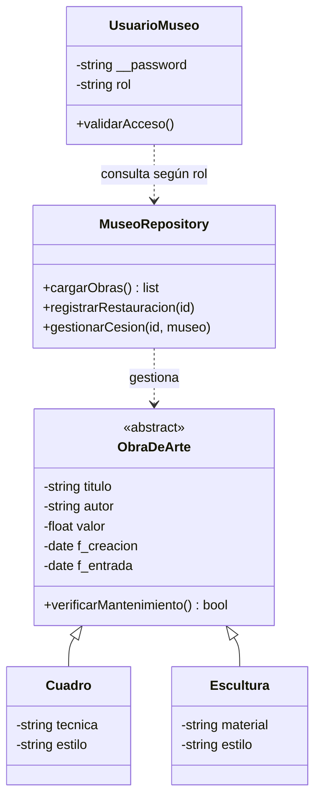

# Manual de Programación: Ejercicio 2 - Gestión de Museo

## 1. Requerimientos Funcionales

Gestión de Catálogo: Registro de cuadros, esculturas y objetos con autor, periodo, valor y fechas clave.

Proceso de Restauración: Control de obras en exposición vs. restauración. Incluye alertas automáticas cada 5 años.

Gestión de Cesiones: Listado de museos colaboradores, control de importes de cesión y cola de espera para obras solicitadas.

Consultas Especializadas: * Restaurador Jefe: Historial de restauraciones ordenado por antigüedad.

Director: Valoración económica total del patrimonio.

Visitante: Listado de obras por salas en monitor de vestíbulo.

## 2. Reglas de Negocio

Mantenimiento Preventivo: Las obras se restauran automáticamente cada 5 años ($t \geq 1825$ días).

Restauración de Emergencia: Envío inmediato si la obra resulta dañada.

Prioridad de Cesión: Si una obra cedida es solicitada, se encola para el siguiente museo al finalizar el periodo actual.

## 3. Integración y Restricciones Técnicas

Persistencia: Uso de archivos CSV (catalogo_museo.csv, restauraciones.csv, usuarios_museo.csv).

Seguridad: Autenticación obligatoria para todos los perfiles.

Encapsulamiento: Protección de datos sensibles de usuarios y valoración económica.

## 4. Modelado Matemático

Para garantizar la precisión en la administración de los activos del museo y el cumplimiento de los protocolos de conservación, se han definido los siguientes modelos:

### 4.1. Valoración Patrimonial Total
La valoración total de la colección ($V_{total}$) se calcula mediante la sumatoria del valor económico individual ($v$) de cada obra ($i$) registrada en el inventario actual de la institución:

$$V_{total} = \sum_{i=1}^{n} v_i$$

Donde:
* $n$: Número total de obras en el inventario.
* $v_i$: Valor asignado a la i-ésima obra de arte.

### 4.2. Algoritmo de Alerta de Mantenimiento Preventivo

La integridad física de las obras se gestiona mediante una alerta basada en el tiempo transcurrido ($\Delta t$). Se define la diferencia entre la fecha del sistema ($f_{actual}$) y la fecha de referencia ($f_{ref}$), la cual corresponde a la fecha de entrada al museo o a la última restauración registrada:

$$\Delta t = f_{actual} - f_{ref}$$

El sistema de seguridad activa una bandera de alerta basándose en el umbral de **1825 días** (equivalente a 5 años), siguiendo la siguiente función por partes:

$$\text{EstadoAlerta} = \begin{cases} \text{Crítico (Mantenimiento Requerido)} & \text{si } \Delta t \geq 1825 \\ \text{Óptimo} & \text{si } \Delta t < 1825 \end{cases}$$

## 5. Diagrama de Clases (UML)

## 6. Justificación del Diseño según Requerimientos

El sistema de gestión de obras de arte se ha diseñado bajo una arquitectura robusta que prioriza la extensibilidad y el cumplimiento de las normativas del museo:

Abstracción y Herencia: La clase ObraDeArte actúa como una base abstracta que centraliza los atributos comunes (autor, periodo, valor). Esto permite que el sistema cumpla con el Principio de Abierto/Cerrado (OCP), facilitando la adición de nuevos tipos de objetos artísticos en el futuro sin modificar la lógica existente de valoración o restauración.

Polimorfismo en la Valoración Patrimonial: Gracias al polimorfismo, el Director del Museo (actuando como Super Usuario financiero) puede ejecutar el cálculo de la valoración total ($V_{total}$) iterando sobre una lista genérica de obras. El sistema procesa cuadros y esculturas uniformemente para obtener la suma económica requerida.

Encapsulamiento de Lógica de Mantenimiento: La regla de negocio de los 5 años ($1825$ días) se ha encapsulado directamente en el método verificarMantenimiento() de la clase base. Esto asegura que el Restaurador Jefe reciba alertas automáticas basadas en un cálculo matemático preciso, independientemente del tipo de obra tratada.

Patrón Repository para Desacoplamiento: La clase MuseoRepository separa la lógica de negocio de la persistencia física en archivos CSV. Este desacoplamiento es vital para gestionar la trazabilidad de las restauraciones y las cesiones a otros museos, permitiendo que el estado de una obra cambie de "Expuesta" a "En Restauración" de manera íntegra.

Seguridad Basada en Roles: Se implementó una jerarquía de acceso mediante la clase UsuarioMuseo. Utilizando atributos privados para las credenciales, se garantiza que el Visitante acceda exclusivamente a la información pública del monitor, mientras que las funciones críticas de modificación del catálogo (Encargado) y gestión de importes de cesión (Director) queden protegidas.

Gestión de Cesiones y Colas: El diseño contempla la persistencia de estados para gestionar la prioridad de cesión. Si una obra está cedida, el sistema encola las solicitudes posteriores, asegurando que la gestión del Director sea fluida y respetuosa con los periodos de tiempo pactados.

## 7. Estándares de Calidad:

Aplicación de principios S.O.L.I.D. (especialmente Responsabilidad Única e Inversión de Dependencias).
Uso estricto de PEP8 para la implementación en Python.

## 8. Entregables Esperados

Análisis y diseño mediante diagramas UML detallados.

Código fuente funcional con persistencia lógica de los estados de restauración.